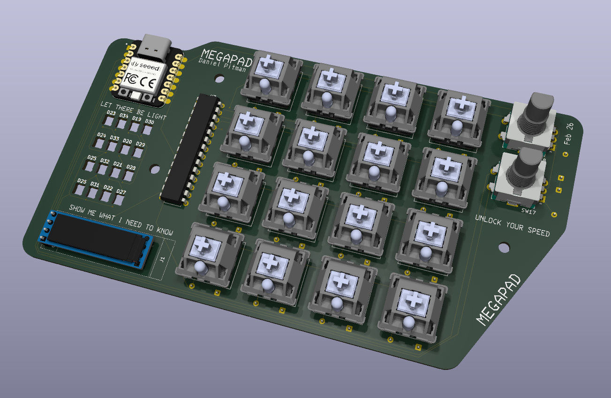
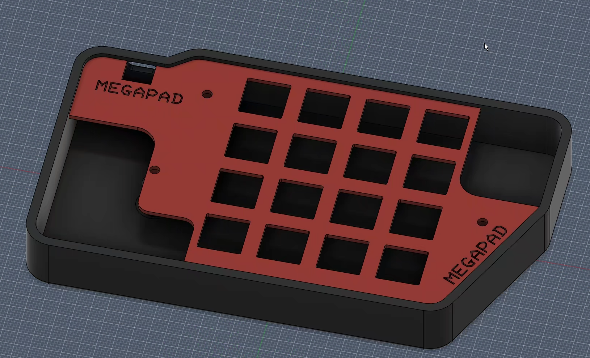
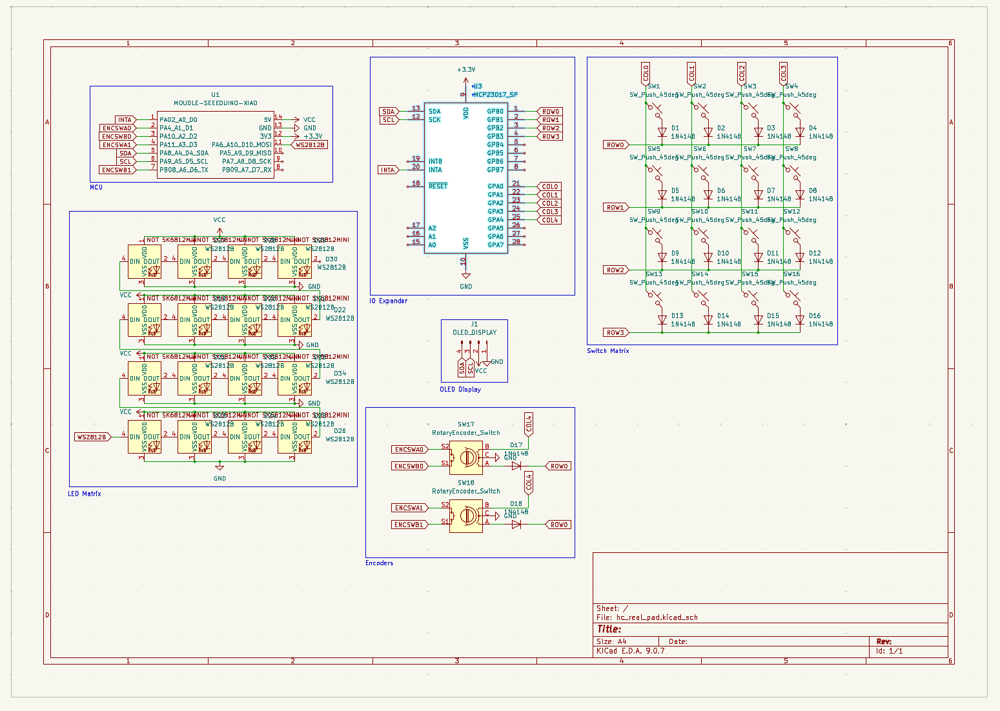
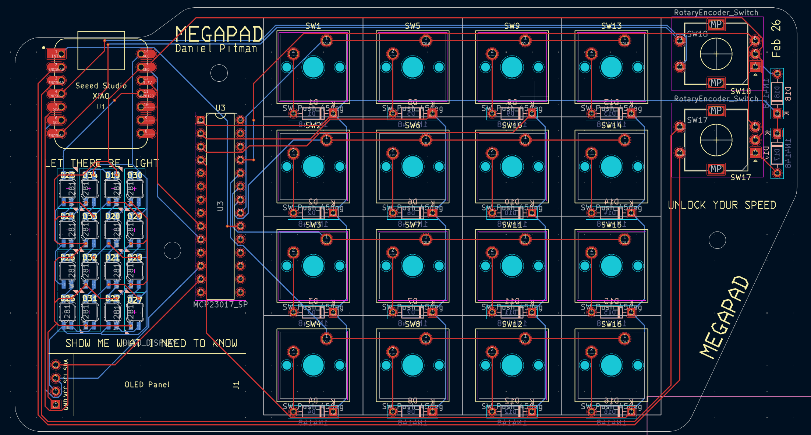

# MEGAPAD

MEGAPAD is a macropad that has all the features that you could ever want in a macro pad. Made for Hackclub blueprint.

## FEATURES
MEGAPAD has alot of features so it was difficult to list them all. But I did it anyway:
- 16 clicky* mechanical key switches
- Dual rotary encoders
- An amazing 16 by 16 RGB matrix
- An OLED Display (128x32)
- All powered by a SEEED XIAO RP2040 microcontroller
- Firmware written with KMK
- An IO Expander (not really a feature but I wanted to include it anyway)

*Clickiness not guaranteed

## CAD MODEL
The CAD model consists of two pieces. The base and the top. The PCB is sandwitched between the top and the base. The base includes standoffs built right in. The standoffs require 3 headset inserts (M3x5mx4mm heatset inserts to be specific; the ones you get in the kit). You will also need 3 M3x16mm screws witch also come in the kit.

## PCB
This was my first time using KiCad and making a PCB in general. In retrospect I should have chosen an easier design first but I made this. I know my traces aren't routed the best but as I said it was my first time.

## FIRMWARE
The firmware is very bare bones at the minute. I haven't made the macropad yet so I can write anymore detailed firmware. Right now it is based on KMK, however I want to write my own in C++. Because I don't have the hardware I can't test it. When I build it I will update the firmware. It might stay on KMK or it might not we'll see. Also becuase I haven't built it, I have no idea if the firmware works so take that into mind if you wish to build it yourself (you probably shouldn't).

## BOM
- 16x Cherry MX Switches
- 16x Cherry MX Stem Keycaps
- 18x 1N4148 Diodes
- 1x XIAO RP2040
- 2x EC11 Rotary Encoder
- 16x SK6812MINI-E LEDs
- 1x MCP23017
- 1x 0.91" 128x32 OLED Display

Case
- 3x M3x5mx4mm Heatset Inserts
- 3 M3x16mm Screws
- Case Parts (the top and bottom parts)
